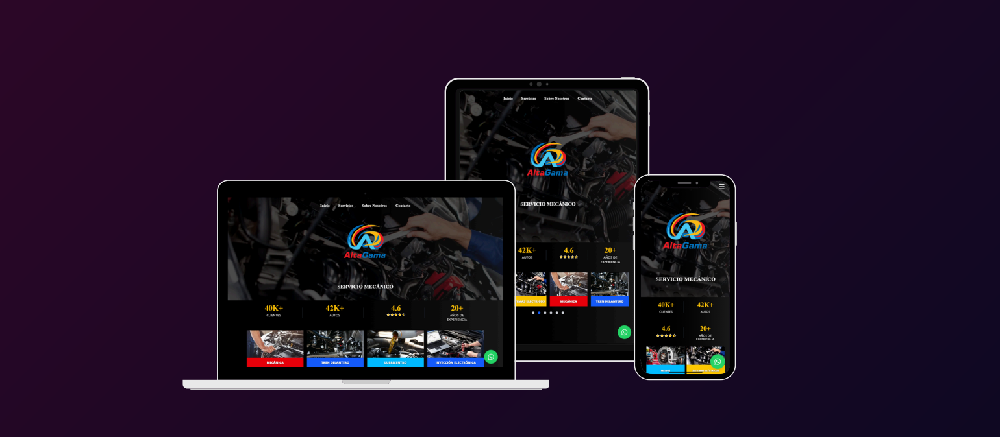
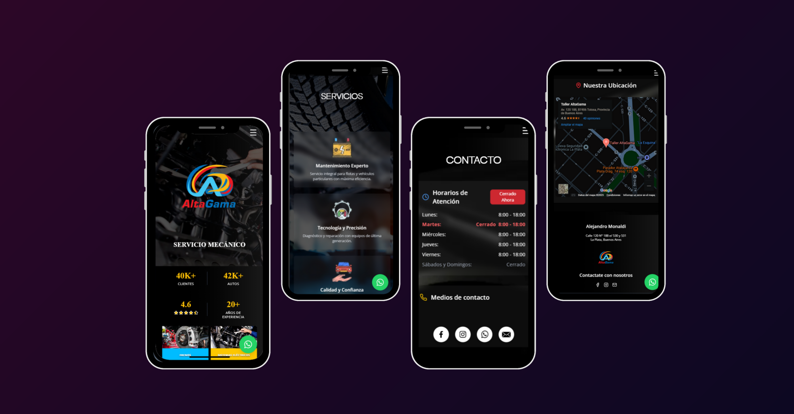

# 🚗 Servicio Mecánico Integral Altagama  

Repositorio de la landing page de **Altagama**, un taller mecánico ubicado en **La Plata**, especializado en brindar un servicio de alta calidad para el mantenimiento y reparación de vehículos.  

## 🚀 Tecnologías Utilizadas  

Este proyecto ha sido desarrollado utilizando las siguientes tecnologías:  

- ⚛️ **React** 
- ⚡ **Vite**  
- 🎨 **Tailwind CSS** 

## 🛠️ Acerca del Proyecto  

Este sitio web actúa como la carta de presentación del taller **Altagama**, proporcionando información sobre sus servicios, valores y formas de contacto. La landing page ha sido diseñada con un enfoque **mobile-first**, priorizando la experiencia en dispositivos móviles y adaptándose de manera fluida a pantallas de escritorio. La interfaz se presenta con un diseño **minimalista y moderno**, optimizado para una experiencia de usuario coherente en todas las plataformas.  

## 🌐 Enlace al Proyecto  

Sitio web en:  
🔗 [https://talleraltagama.com/](https://talleraltagama.com/)  

## 🌆 Vistas del Proyecto

